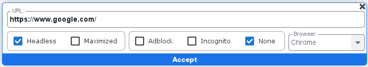

### Función Headless

Al seleccionar la opción "headless" esta permite ejecutar una automatización web sin interfaz gráfica utilizando el explorador Chrome y visualizando que está siendo ejecutada en el administrador de tareas

### Función incognito

Al seleccionar la opción "incognito" esta permite abrir una página web en modo incognito en el explorador Chrome

### Función None

Al seleccionar la opción "none" esta permite abrir una página web en el explorador Chrome por defecto teniendo seleccionada la opción none

### Función Maximized 
Al seleccionar la opción "maximized" esta permite abrir una página web en el explorador Chrome en pantalla completa

### Función AdBlock
Al seleccionar la opción "Adblock" esta permite activar AdBlock para bloquear los anuncios de una página web en el explorador Chrome

