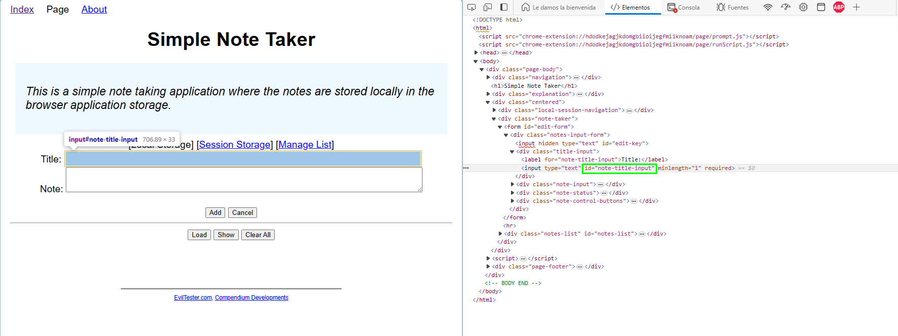
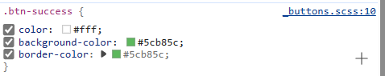

- [Selector XPATH](#selector-xpath)
- [Selector ID](#selector-id)
- [Selector ClassName](#selector-classname)
- [Selector CssSelector](#selector-cssselector)
- [Selector LinkText](#selector-linktext)
- [Selector Name](#selector-name)
- [Selector TagName](#selector-tagname)

#### Selector XPATH

Este selector permite usar el valor de un campo en **XPATH** en el inspector de elementos de una página y así poder tener una acción automatizada en S-BOT

#### Selector ID

Este selector permite usar el valor de **ID** en el inspector de elementos de una página y así poder tener una acción como el click automatizada en S-BOT

#### Selector ClassName
Este selector permite usar el valor de la clase de un elemento **class** en el inspector de elementos de una página y así poder tener una acción como el click automatizada en S-BOT

#### Selector CssSelector
Este selector permite usar el valor de la clase de un elemento **CssSelector** en el iunspector de elementos de una página y así tener una acción como el click automatizada en S-BOT

#### Selector LinkText

#### Selector Name
Este selector permite usar el valor de un selector **name** en el inspector de elementos de una página y así poder tener una acción automatizada en S-BOT

#### Selector TagName
