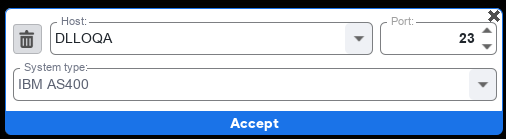
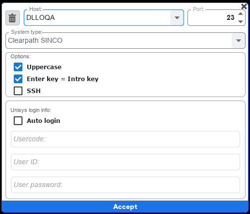
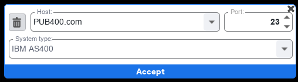
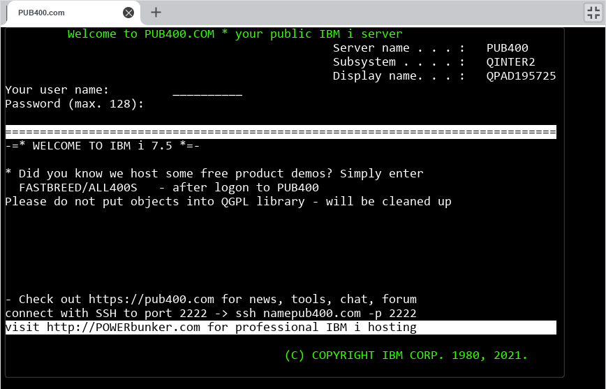
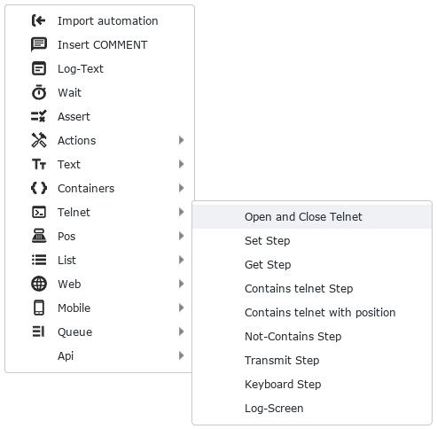
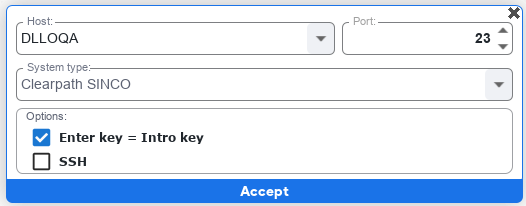

## Botón SWITCH 

Al abrir S-BOT en la parte superior derecha se tiene un botón switch donde al seleccionar se abre una ventana donde se encuentra una terminal para ejecutar funcionalidades basadas en AS400 y otras tecnologías

## Panel de funciones TELNET

Este panel de funciones aparece al dar segundo clic en la barra superior gris y tendremos funciones como:

- New TELNET connection
- New POS connection
- New APP connection
- New On "cande" report
- New ODT report
- SINCO screens
- Start record
- Visual settings

En este caso nos enfocaremos en la función **TELNET**

## Función Telnet Connection

Al seleccionar la función _new telnet connection_ nos encontramos con campos como **HOST**, **PORT** y **System type**.

- **HOST**: Se puede escribir dentro cual será la dirección donde se ingresara, estas quedan guardadas para futuros usos.
- **PORT**: Se puede elegir o tipear el puerto al que será conectada la nueva conexión TELNET.
- **System Type**: Se muestra una lista desplegable según la configuración del HOST.
- **Botón eliminar**: Elimina el host seleccionado.

Al seleccionar DLLOQA en HOST y seleccionar Clearpath SINCO se habilitan opciones como:

- **Uppercase**: Permite que al escribir todas sus letras sean en mayúscula
- **Enter key** = **intro key**: Permite que al pulsar la tecla "ENTER" su acción funcione en S-BOT
- **SSH**: Secure SHell es un protocolo de red usado principalmente para la conexión con máquinas por la línea de comandos. 
- **Auto login**: Permite guardar los datos de ingreso para no volver a ingresarlos como: Usercode, user ID y user password

## Acceso a AS400

Para ingresar a AS400 desde TELNET se debe ingresar: 
- en el campo **HOST** la siguiente información: **PUB400.COM** 
- en el campo **"PORT"** se ingresa **23**
- en el campo **"System type"** se selecciona la opción **IBM AS400**

Al aceptar la información ingresada de AS400 se muestra la siguiente pantalla.

## Panel de funciones TELNET en SBOT

## Acción Open and Close TELNET

Open and close Telnet cumple la función de abrir (open) un HOST de TELNET como [AS400] y al finalizar un proceso, cerrarlo (close), posee los siguientes campos: 

* HOST: Se ingresa el HOST de telnet para conectarse
* System type: Se selecciona el tipo de sistema como AS400
* Options: Se selecciona si se requiere enter key o SSH.

## Acción Set Step

Set step cumple la función de ingresar (set) información  

## Acción Get Step

## Acción 