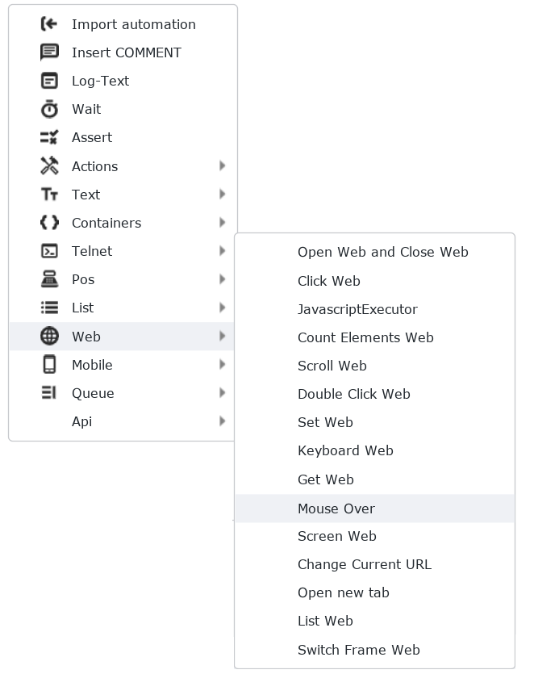
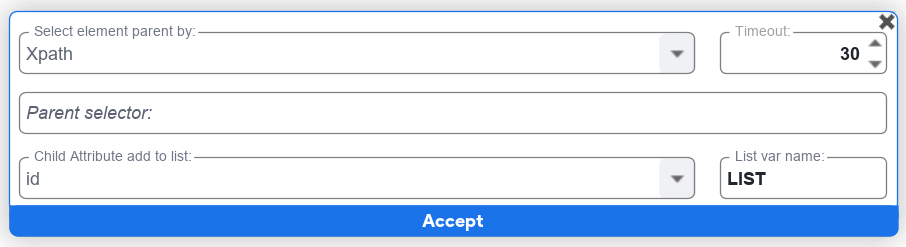

## Acción open web

## Función Headless

La opción **headless** permite ejecutar la automatización web sin mostrar la interfaz gráfica del navegador. En otras palabras, la navegación se realiza en segundo plano, sin abrir una ventana visible. Esto es especialmente útil en tareas de automatización donde la interacción visual no es necesaria, lo que puede mejorar la eficiencia y reducir el consumo de recursos. Aunque el usuario no ve la ejecución, los procesos pueden ser monitoreados en el administrador de tareas u otros registros, proporcionando una forma discreta y eficaz de realizar operaciones automatizadas en la web.

## Función incognito

La opción **incognito** proporciona un modo de navegación privada donde se pueden abrir ventanas sin que el historial de navegación, cookies o datos de sesión se almacenen localmente. En este modo, las actividades de navegación no quedan registradas en el historial, y al cerrar la ventana incógnito, se eliminan automáticamente los datos asociados a esa sesión. Esto resulta útil cuando se desea explorar la web de manera temporal sin dejar rastro en el historial de navegación ni afectar la información almacenada en el navegador, proporcionando un nivel adicional de privacidad y confidencialidad durante la sesión de navegación.

## Función None

La opción **Adblock** bloquea la visualización de anuncios publicitarios durante la navegación web. Esta característica permite a los usuarios disfrutar de una experiencia de navegación más limpia y libre de distracciones al evitar los anuncios intrusivos en las páginas visitadas. Adblock utiliza listas predefinidas o personalizables de anuncios conocidos para impedir su aparición, proporcionando así mayor control sobre el contenido que se muestra durante la navegación. Además de mejorar la estética de la experiencia en línea, Adblock también puede contribuir a una carga más rápida de las páginas al reducir la cantidad de datos que se descargan al cargar anuncios.

## Lista de Navegadores

La lista de **Navegadores** te permite abrir seleccionar los multiples navegadores instalados y soportados por la herramienta SBOT.

## Función Maximized 
La opción **maximized** se refiere a la capacidad de abrir la ventana del navegador con tamaño máximo, ocupando toda la pantalla disponible. La ventana del navegador se expandirá para aprovechar al máximo el espacio de visualización, proporcionando una experiencia de navegación a pantalla completa. Esta característica es útil para aquellos usuarios que desean optimizar su espacio de trabajo y tener una vista más amplia de los contenidos web, eliminando la necesidad de ajustar manualmente el tamaño de la ventana cada vez que abren el navegador.

## Función AdBlock

La opción **Adblock** bloquea la visualización de anuncios publicitarios durante la navegación web. Esta característica permite a los usuarios disfrutar de una experiencia de navegación más limpia y libre de distracciones al evitar los anuncios intrusivos en las páginas visitadas. Adblock utiliza listas predefinidas o personalizables de anuncios conocidos para impedir su aparición, proporcionando así mayor control sobre el contenido que se muestra durante la navegación. Además de mejorar la estética de la experiencia en línea, Adblock también puede contribuir a una carga más rápida de las páginas al reducir la cantidad de datos que se descargan al cargar anuncios.

## Counts Elements

Count Elements es una funcionalidad que posee <a href="http://localhost:8000/codeblock/Selectores" target="_self"> selectores </a> y es utilizada para contar los elementos de esos <a href="http://localhost:8000/codeblock/Selectores" target="_self"> selectores </a>

## Campo VAR (Variable)

En este campo se ingresa una variable donde será almacenada la información obtenida de Count Elements.

## Campo Description

En este campo se ingresa una descripción para identificar con mayor facilidad la función que se realiza.

## Acción Javascript executor

En este campo se puede ingresar código javascript para ubicar un campo o crear una funcionalidad para realizar una automatización

## Campo variable name

En este campo se puede asignar una variable para almacenar información extraída mediante un código javascript

## Campo botón Test script

En este campo se puede realizar un test de funcionalidad antes de ejecutar la automatización ingresando la URL del sitio a automatizar.

## Acción Scroll web

Scroll web es una funcionalidad que permite ubicarse en una sección en especifico de una página web.

### Campo Scroll Pixels

En este campo se puede realizar scroll en la página en una sección en especifico ingresando los pixeles.

### Campo select scroll top page

Al seleccionar este select se puede realizar scroll hasta el top (arriba/parte principal) de la página

### Campo select scroll bottom page

Al seleccionar este select se puede realizar scroll hasta el bottom (abajo/footer) de la página

## Acción Set web

Set web es una funcionalidad que posee [selectores](https://guia.sbot.co/codeblock/Selectores) y es utilizada para ingresar información en un formulario según el [selector](https://guia.sbot.co/codeblock/Selectores) seleccionado se ingresa la información requerida, esta acción posee los siguientes campos: 

* Text: Se ingresa la información que se requiere en el formulario
* Description: Se ingresa la información descriptiva para identificar facilmente cual es el campo.

## Acción Get web

Get web es una funcionalidad que posee [selectores](https://guia.sbot.co/codeblock/Selectores) y es utilizada para extraer información de una página web y almacenar la información en una variable, esta acción posee los siguientes campos:

* Attribute: Se selecciona de una lista desplegable el atributo del campo a extraer
* VAR: Se ingresa el nombre de una variable donde será almacenada la información extraida
* Description:  Se ingresa la información descriptiva para identificar facilmente cual es el campo.

## Acción Keyboard web

Keyboard web es una funcionalidad que posee [selectores](https://guia.sbot.co/codeblock/Selectores) y es utilizada para simular un botón en una  página web, esta acción posee los siguientes botones: Enter, back space, escape y tab.

* Enter: Funciona como el botón "enter" del teclado.
* Back_space: Funciona como el botón de "borrar" del teclado.
* Escape: Funciona como el botón "escape" del teclado.
* Tab: Funciona como el botón "tabulador" del teclado.

## Acción Mouse Over

Mouse Over es una funcionalidad que permite posicionarse de forma sostenida en un punto de una página web, se usa principalmente para menús desplegables que se requieren tener abiertos para llegar a otro menú, posee los siguientes campos:

* Select by: Es un campo desplegable donde se selecciona el tipo de elemento por el cual va a buscar
* Selector: Se ingresa el valor del elemento el cual se usará como selector.
* Time Out: Tiempo de espera para encontrar el selector.
* Description (optional): Se ingresa la información descriptiva para identificar facilmente cual es el campo.

## Acción Screen Web

Screen Web es una funcionalidad para capturar una imagen de una ubicación especifica de la página web y guardarla en el computador y ruta deseada, posee los siguientes campos:

* Save image as base 64 text: Guarda la imagen de forma base 64, la cual es basicamente una madena de codificar la imagen
* Save image in html file: Guarda la imagen capturada en un archivo html.
* Log file: Permite escribir la ruta y el nombre con el que se va a guardar el archivo de la imagen capturada
* Botón con icono de carpeta: Se abre el explorador de archivos permitiendo seleccionar la ruta y el nombre más fácil 
  

## Acción Change current URL

Change current URL es una funcionalidad que permite cambiar la URL para redirigirte a otra página en la misma pestaña.

## Acción Open new tab

Open new tab es una funcionalidad que permite redireccionar a otra página abriendo una nueva pestaña

## Acción List Web

List Web es una funcionalidad que permite crear una lista trayéndose los datos de la página 

## Acción Switch Frame Web

Switch Frame Web es una funcionalidad que permite moverse entre pestañas del navegador o interactuar con alertas que viene desde el navegador y no la pagina

