Los selectores son elementos fundamentales en la mayoría de las funciones de S-BOT destinadas a la automatización web. Su importancia radica en la capacidad de ser reutilizados en diversas instancias, adaptándose a los requisitos específicos de cada automatización realizada por el usuario. Dado que desempeñan un papel central en estas funciones, permiten una mayor flexibilidad y eficiencia en la creación y ejecución de pruebas, facilitando la adaptación a los distintos escenarios de prueba que puedan enfrentar.

### Selector XPath

Esta funcionalidad resulta esencial para llevar a cabo acciones automatizadas de manera eficiente en S-BOT. Al permitir la identificación precisa de elementos a través de la expresión **XPath**, los usuarios pueden realizar selecciones específicas en una página web, facilitando así la creación de automatizaciones más precisas y adaptadas a los requisitos particulares de cada escenario de prueba.

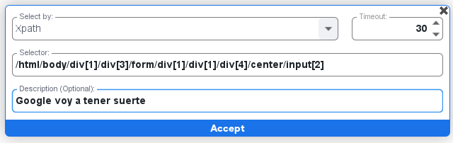

Una manera sencilla de obtener la expresión XPath sería desde el menú de herramientas de desarrollo. Puedes inspeccionar el elemento deseado y, al seleccionar el elemento con el botón derecho del indicador, copiar la expresión XPath.

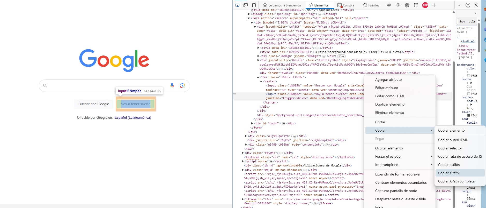

### Selector ID

Este selector permite utilizar el valor de **ID** en el inspector de elementos de una página, facilitando acciones automatizadas, como clics, de manera más precisa en S-BOT. Al aprovechar los identificadores únicos asignados a elementos específicos, se simplifica la interacción automatizada y se promueve una ejecución más eficiente y específica de acciones en S-BOT.

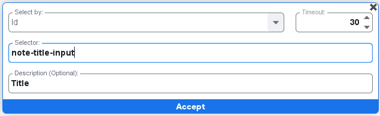

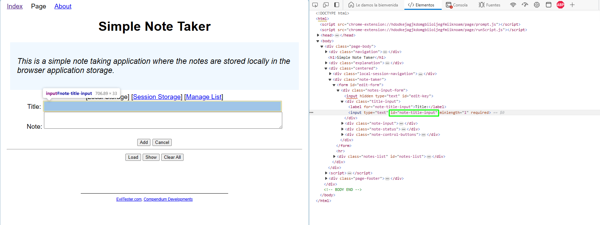

### Selector ClassName

Este selector permite utilizar el valor de la clase de un elemento **Class** en el inspector de elementos de una página, facilitando acciones automatizadas, como clics, de manera precisa en S-BOT. Al aprovechar las clases asignadas a elementos específicos, se simplifica la interacción automatizada, promoviendo una ejecución eficiente y específica de acciones en S-BOT.

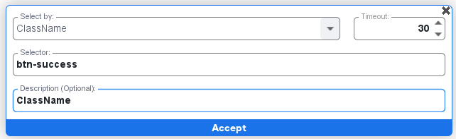

En el siguiente ejemplo se muestra el valor que podemos copiar de la clase como referencia.
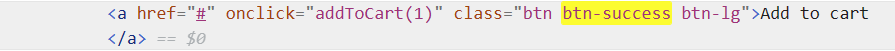

### Selector CssSelector

Este selector en S-BOT permite utilizar eficazmente el valor de la clase de un elemento mediante **CssSelector** en el inspector de elementos de una página, facilitando acciones automatizadas como clics con precisión. Al aprovechar las clases asignadas a elementos específicos, se simplifica la interacción automatizada, promoviendo ejecuciones eficientes y específicas en S-BOT.

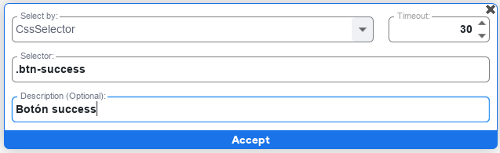

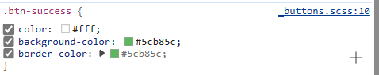

### Selector LinkText

Este selector LinkText en S-BOT facilita la utilización del valor contenido dentro de una etiqueta que se encuentra en el selector de elementos. La importancia de esta funcionalidad radica en su capacidad para identificar y seleccionar específicamente enlaces (ligas) basándose en el texto visible dentro de la etiqueta **<a\>**. Esto posibilita acciones automatizadas más precisas y específicas, como hacer clic en un enlace concreto que contenga el texto "Wikipedia".

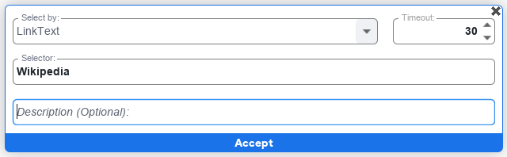

     <a class="abc...xyz" href="https://es.wikipedia.org/wiki/" data-jsarwt="1" data-usg="xyz" data-ved="xyz"> Wikipedia </a>

### Selector Name

Este selector **Name** busca el atributo name en el código HTML, esto agrega flexibilidad al proceso de interacción automatizada. Al identificar y seleccionar elementos según su atributo **name** ó nombre. Este enfoque contribuye a una ejecución más precisa y controlada de acciones automatizadas en S-BOT, ampliando así sus capacidades.

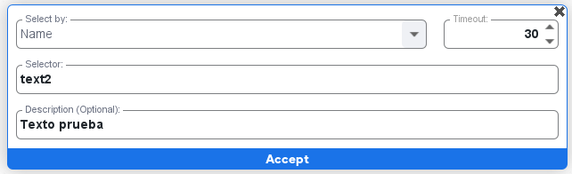

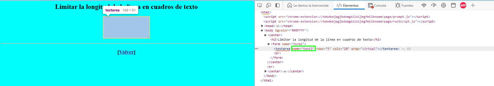

### Selector TagName

Este selector de tipo **Tagname** en S-BOT posibilita la utilización de cualquier etiqueta de manera general en el inspector de elementos. Por ejemplo, al emplear **<div\>**, se obtendrá el valor de la primera etiqueta de este tipo que encuentre en el explorador. Esta funcionalidad resulta útil al permitir la identificación y selección de elementos basándose en la etiqueta específica que los envuelve. Facilita la creación de automatizaciones flexibles y adaptadas a diversas etiquetas, brindando una mayor versatilidad en la interacción automatizada con el contenido de la página web.

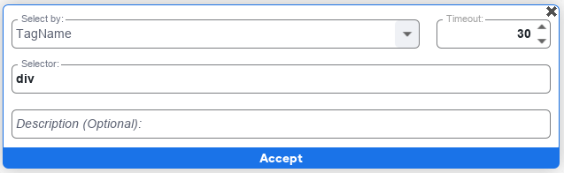

Y este hará click en la primera etiqueta <div\> que encuentre en el código HTML, **no es recomendable su uso, si se requiere una sola etiqueta en especifico**

#### Función TimeOut

Esta función en la automatización web proporciona la capacidad de configurar el tiempo de espera para localizar el selector especificado. En caso de no encontrar el selector dentro del período de tiempo establecido, se mostrará un mensaje de error en la pantalla de ejecución. Esta configuración temporal es crucial para gestionar eficientemente situaciones en las que la identificación del selector pueda llevar más tiempo del previsto, evitando así ejecuciones prolongadas y mejorando la gestión de errores durante el proceso de automatización.

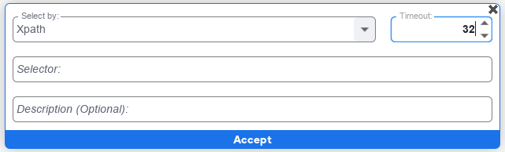

Ejemplo:

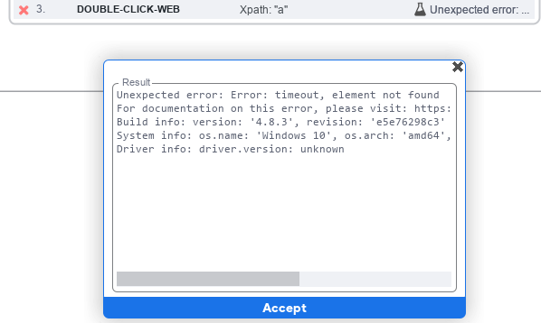