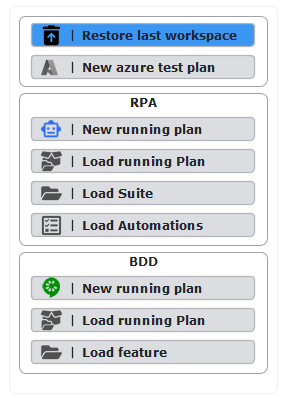

#### 1. Crear una automatización en AS400 en SBOT

En este paso realizaras una automatización en AS400.

1. Se selecciona la opción "New Running Plan" en RPA

2. Se abre la ventana de suites y en la suite se selecciona el botón "edit suite automations" o se da doble clic en "new suite"

3. Se abre una ventana de automatizaciones, donde al dar clic derecho del mouse se despliegan diferentes acciones, se sobrepone el mouse en “Telnet” y selecciono la primera acción llamada “Open and Close Telnet”

4. Se selecciona lo que aparece en la línea de código de OPEN-TELNET “Host: (DLLOQA:23)” y se abre una ventana con los campos Host, Post, System type y Options, los cuales se parametrizarán de la siguiente forma y se presiona aceptar: 

5. Se presiona el botón de color azul "save all and back" 

6. Se presiona el botón "PLAY" y se visualiza la conexión a AS400 de IBM como en la siguiente imagen:

