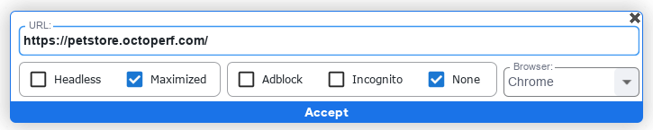

## Automatización web en S-BOT

En este paso realizaras una automatización web en SBOT

1. Se selecciona la opción **New Running Plan** en RPA

2. Se abre la ventana de suites y en la suite se selecciona el botón **edit suite automations** o se da doble clic en **new suite**.

3. Se abre una ventana de automatizaciones, donde al dar clic derecho del mouse se despliegan diferentes acciones, se sobrepone el mouse en **Web** y selecciono la primera acción llamada **Open and Close web**.

4. Se selecciona lo que aparece en la línea de código de **OPEN-WEB** **URL: https://www.google.com/** y se ingresa la URL, se selecciona el explorador y otras caracteristicas según sea requerido para automatizar la página.

5. Se da clic derecho del mouse nuevamente para desplegar las acciones y seleccionar en este caso la opción **click web**.

6. Al seleccionar **click web** y se presiona el resultado de la línea de código **XPath** entonces se debe ingresar un valor XPath que se obtiene en el inspector de la página **Pet Store**, se ingresa en el campo de SBOT y se da clic en aceptar.

7. Se presiona en el botón azul **Save all and back**. 

8. Se presiona el botón **Play** y se visualiza la ejecución correcta de la automatización web.

